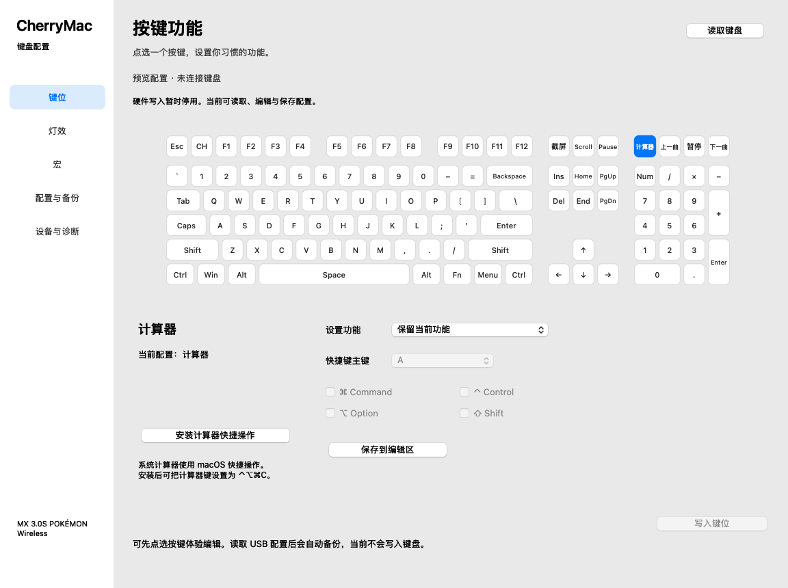

# CherryMac

为 **CHERRY MX 3.0S 宝可梦无线键盘**提供 Mac 客户端和网页版。点选键盘图，设置按键、编辑宏与配色，备份和迁移配置。

[打开在线配置](https://cherrymac.goforit.si/app/) · [项目官网](https://cherrymac.goforit.si/) · [Mac 0.69.0 预览版](https://github.com/5hux1n/CherryMac/releases/tag/v0.69.0) · [PHP 0.68.0 预览版](https://github.com/5hux1n/CherryMac/releases/tag/web-v0.68.0)

**当前是开发预览，完整复刻仍未完成。** USB 有线模式下提供按键、宏和文本触发键的独立写入、备份与读回核对。灯效可以编辑、保存和导出计划，普通版未开放灯效发送。新版两端仍待统一真机验收；旧网页灯效故障根因尚未确认。[各功能的实际验收范围](docs/当前功能与验收状态.md)



## 选择使用方式

**在线版**：用 Chrome 或 Edge 打开[配置工具](https://cherrymac.goforit.si/app/)，无需安装 PHP 或构建。连接实体键盘需 USB 数据线和有线模式。配置、备份和日志留在浏览器本地，不上传服务器。

**Mac 客户端**：支持 Apple Silicon、macOS 13 及更新版本。解压 Mac 预览 ZIP，将 `CherryMacMacroPreview.app` 放入“应用程序”，退出旧版再打开。应用使用临时签名，尚未 Apple 公证；Intel 暂未验证。系统阻止打开时，确认来源后参考 [Apple 的打开说明](https://support.apple.com/zh-cn/102445)。

**本地 PHP 版**：电脑已有 PHP 时，解压 PHP 预览 ZIP，双击 `start.command`，用 Chrome 或 Edge 打开 `http://localhost:8770/`。无需 Node、Composer、数据库或构建。手动启动：

```sh
CHERRY_MACRO_PRODUCT=1 CHERRY_TEXT_PRODUCT=1 php -S 127.0.0.1:8770 -t .
```

浏览器中的备份按网址分别保存，在线版和 localhost 不共用数据。迁移前导出配置与备份。[网页部署与使用说明](Web/README.md)

## 按功能设置

| 页面 | 可以做什么 |
| --- | --- |
| 按键功能 | 点选按键，设置普通键、组合键、媒体功能、Mac 启动快捷键或禁用；单独写入键位 |
| 灯效 | 编辑内置模式、亮度、速度与颜色；逐键、多选配色、渐变、熄灭；保存配置或导出计划 |
| 宏 | 录制、编辑、排序、复制、改名、删除和绑定；设置次数、按住持续或再次按键停止；单独写入与恢复 |
| 文本 | 编辑文字和按键绑定、安装触发键；通过 Mac 服务向前台应用输入 |
| 配置与备份 | 导入／导出官方和 CherryMac JSON、撤销草稿、恢复按键或宏、核对恢复记录 |
| 设备设置 | 保存官方 USB 回报率文件草稿；客户端提供 Mac 快捷操作与按键适配 |
| 设备与诊断 | 查看连接状态、备份与操作日志，导出排查资料 |

单个普通键保持正方形；计算器、上一曲、播放／暂停、下一曲位于数字区上方。切换页面保留草稿，导入和编辑不会自动写入。

逐键配色取得实际 LED 映射后可从空白开始，不需要先导入官方文件。未写入的草稿导出 JSON 保存；“保存本机配色”只保存与最近读回匹配的原始 RGB。Windows 格式导出需要本型号官方根模板；缺少颜色表时可补齐，隐藏颜色和未知字段保留。

宏支持键盘及五个鼠标按钮，滚轮尚未支持。扩展宏最多 762 个事件，按绑定数量计算存储占用；未绑定宏保存在本机。旧配置可在宏页点击“启用扩展宏编辑”迁移草稿，核对后再写入。文本内容由 Mac 保存和输入，需要客户端持续运行及辅助功能权限，键盘保存的是触发键。[宏、文本与联动说明](docs/宏产品预览.md)

## 写入与恢复

先连接 USB、切换有线模式并读取当前配置。编辑后在对应页面发起写入，核对改动、松开全部按键，再用鼠标确认。程序保存完整备份，逐包发送并完整读回；状态栏显示完成或具体错误。

按键写入只处理键位表；宏写入只处理宏库和绑定键。其他草稿留在编辑区。Fn、CHERRY 内部键和隐藏位置受保护。配置与备份页提供按键和宏恢复入口，恢复前会重新读取并核对变化范围；断线或超时不保证自动恢复成功。

客户端备份位于 `~/Library/Application Support/CherryMac/HardwareBackups`。网页资料保存在当前浏览器、当前网址；清理网站数据前下载备份。设备与诊断页可查看或导出自动记录的请求、回复和错误，无需手工抓包。

计算器、Finder、邮件、音乐的启动组合键需要先在 Mac 客户端安装对应快捷操作，再单独写入键位。计算器已有局部实机结果，其他启动入口仍待验收。蓝牙下的 F5 → ⌘R 软件适配需要客户端运行；无线配置写入尚未确认。[Mac 应用启动说明](docs/Mac应用启动.md)

## 当前限制与开发状态

设备设置目前只编辑官方配置文件的回报率草稿，尚未实现完整硬件写入；完整恢复默认也未开放。灯效发送保留在独立研究包，未包含在普通在线版。更多键位、宏执行方式、文本、灯光外观、断电保留及无线使用仍需统一验收，局部成功不代表全部功能通过。

源码、编译签名、包完整性和线上静态文件核对分别记录；本次公开预览交付未新增功能或真机测试。此前 Mac 0.12.0／PHP 0.6.0 包仍保留在[历史发布](https://github.com/5hux1n/CherryMac/releases)。

[完整移植目标](docs/移植验收目标.md) · [当前功能与验收状态](docs/当前功能与验收状态.md) · [线上更新说明](docs/Cloudflare在线版.md) · [灯效异常调查](docs/网页版灯效异常排查.md) · [反馈问题](https://github.com/5hux1n/CherryMac/issues)

本项目与 CHERRY 官方无关联。公开包不包含官方软件、用户原始配置或真机日志。

在“配置与备份”点击“检查默认配置操作记录”，可离线检查 CherryMac 默认配置事务 JSON，并导出原始备份和分析资料；无需连接键盘。记录有完整、可识别的读回时才能另行导出撤回计划。备份包含原始宏区，不补造宏名称；导入只载入草稿。记录读回不是当前键盘状态，也不能证明实体输出或断电保留；实际恢复仍需重新读取和核对。完整恢复默认写入尚未开放。

内置灯效选项按本型号官方模式分别开放：不适用的速度、方向、单色／彩虹切换或内置单色会禁用，保存时保留这些参数原值。例如常亮不调速度，光谱不调单色；逐键颜色在逐键配色页设置。这是编辑选项对齐，灯效写入和外观仍待统一验收。
