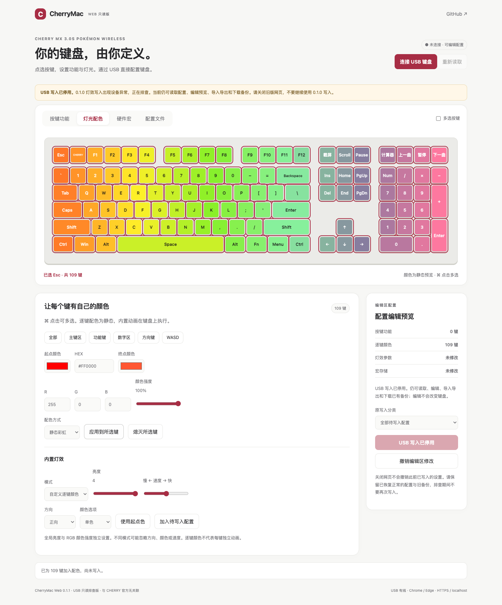

# CherryMac

[项目网站](https://cherrymac.goforit.si/)

为 **CHERRY MX 3.0S 宝可梦无线键盘**提供 Mac 客户端和无需构建的 PHP 网页版。点选键盘图，设置按键功能，保存、迁移和恢复配置。

**当前是按键写入测试版，完整复刻仍在推进。** USB 有线模式下开放独立键位写入、自动备份和读回核对；灯效与宏可以编辑、导出，实体写入暂缓。客户端已在计算器键位实测普通键、组合键、媒体输出、禁用与还原；计算器组合键另有用户确认断电后的保留证据。网页版也已实测普通键写入与还原。其他键位、更多网页键型和无线使用仍在验收。旧网页灯效故障根因尚未确认。

[下载 Mac 0.10.0](https://github.com/5hux1n/CherryMac/releases/tag/v0.10.0) · [下载 PHP 网页版 0.4.0](https://github.com/5hux1n/CherryMac/releases/tag/web-v0.4.0) · [反馈问题](https://github.com/5hux1n/CherryMac/issues)


## 按键设置怎么用

1. 用 USB 数据线连接键盘，切换到有线模式，读取当前配置。
2. 在“按键功能”点选按键，设置组合键、截图、刷新、媒体控制或禁用，保存到编辑区。
3. 点击“写入键位”（网页为“写入按键”），核对改动，松开全部按键，用鼠标确认。写入期间不要使用键盘。
4. 程序先核对基线并保存备份，随后写入键位表、完整读回核对；状态栏显示完成或具体错误。

Fn、CHERRY 内部键与隐藏位置保留原功能。当前禁止新增、移除或修改宏绑定。导入和编辑不会自动写入；灯效与宏草稿也不会随按键写入。

计算器需要先在客户端安装“计算器快捷操作”，再把计算器键设置为“打开系统计算器”。由 macOS 服务启动应用，CherryMac 无需持续监听；快捷操作是否生效也取决于前台应用的服务支持。[已有实机结果与证据范围](docs/计算器键实机验证.md)

## 找到你要用的功能

两端采用相同的五个菜单，切换页面保留编辑区配置。

| 菜单 | 可以做什么 |
| --- | --- |
| 按键功能 | 点选按键、编辑功能、独立写入键位表 |
| 灯效 | 编辑内置模式、亮度与速度；单键或区域配色、渐变与熄灭，暂不写入 |
| 宏 | 编辑按下、松开与延迟；指定次数、按住持续或再次按键停止，暂不写入 |
| 配置与备份 | 导入／导出 JSON、查看备份、恢复按键或撤销草稿 |
| 设备与诊断 | 查看状态、打开操作日志或导出排查资料；客户端提供 Mac 端适配设置 |

普通单键保持正方形。计算器、上一曲、播放／暂停、下一曲位于 Num、/、×、− 上方。灯效分为“内置灯效”和“逐键配色”，配置与诊断独立成页。

## 使用 Mac 客户端

支持 macOS 13 及更新版本，下载包适用于 Apple Silicon（M1 及更新芯片）；Intel 暂未验证。解压后将 `CherryMac.app` 放入“应用程序”，退出旧版再打开。

应用尚未经过 Apple 公证。遇到系统阻止打开时，先确认来源，再参考 [Apple 打开 App 的说明](https://support.apple.com/zh-cn/102445)。

独立的 Mac 端按键适配默认暂停，可用于蓝牙连接下的 F5 → ⌘R 等映射；需要应用持续运行以及输入监控、辅助功能权限。硬件键位写入与此适配分别操作，无线配置写入仍未确认。

## 使用网页版：PHP，无需构建

解压网页 ZIP，双击 `start.command`，用 Chrome 或 Edge 打开 <http://localhost:8768/>。也可在解压目录运行：

```sh
php -S 127.0.0.1:8768 -t .
```

部署只需上传 `index.php` 与整个 `assets` 到 HTTPS 的 PHP 网站。不需要 Composer、npm、数据库或打包构建。配置文件在浏览器本地处理，不上传服务器。已经打开的旧页面须关闭后重新打开。



[网页版使用与部署说明](Web/README.md) · [详细使用说明](docs/使用说明.md)

## 备份、恢复与日志

支持 CherryMac 配置和本型号 Windows 官方 JSON。Windows 导入前先读取键盘，以保留隐藏位置和未知参数；不支持的绑定会拒绝整个导入。

客户端在“配置与备份”选择“恢复最近按键备份”，程序重新读取后展示恢复改动，确认后只恢复键位表。也可导入其他备份再写入键位。备份位于 `~/Library/Application Support/CherryMac/HardwareBackups`；“设备与诊断 → 打开操作日志”可查看自动保存的请求、回复和错误。

网页在“配置与备份 → 查看本地备份”导入编辑区，核对后写入按键即可恢复键位。“设备与诊断 → 导出排查资料”下载备份及操作日志。数据保存在当前浏览器、当前网址；清理网站数据会删除它们，请下载保留。

写入错误后需重新读取。只有连接仍可用、配置变化仍在本次原表／目标表范围内、日志正常且按键已松开时才尝试恢复；断线或超时不保证自动恢复成功。当前恢复入口仅处理按键，不恢复灯效与宏。请关闭并停止使用旧版 0.1.0 网页。

## 开发与验证

客户端需 Xcode 命令行工具，运行 `bash Source/build.sh` 会先离线自测，再生成 `.app` 和 ZIP。网页核心自测运行 `node --test Web/tests/core.test.mjs`；仅开发测试需要 Node。可选浏览器测试 `Web/tests/browser-keymap.mjs` 需要 Playwright，使用模拟 WebHID，不连接实体键盘。

新增宏执行方式已通过两端官方 JSON 转换一致性检查。[宏执行模式移植与限制](docs/宏执行模式移植.md)

本版通过客户端离线自测、26 项网页核心测试及 Chrome 完整操作测试；已有按键产品流程的部分实机证据；完整功能、全部键位与无线使用仍需验收。[本版审查与验证](docs/按键写入版验证.md) · [按键产品实机验收](docs/按键产品流程实机验收.md) · [完整移植验收目标](docs/移植验收目标.md) · [灯效异常调查](docs/网页版灯效异常排查.md)

本项目与 CHERRY 官方没有关联。仓库不包含 Windows 安装程序、官方图形资源或用户原始配置和日志。
