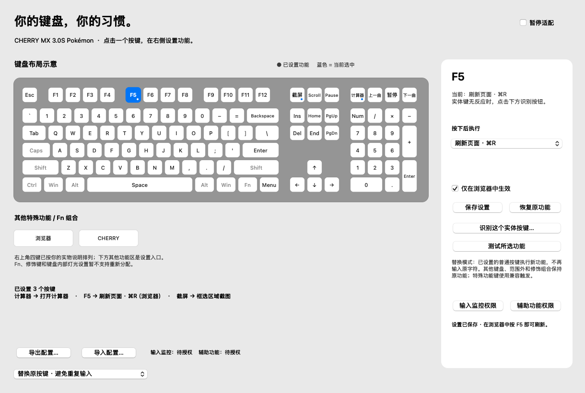

# CherryMac

为 CHERRY MX 3.0S 宝可梦无线键盘制作的原生 macOS 菜单栏适配工具。通过可点选键盘图配置按键功能。



## 当前功能

- 截屏键触发框选截图（⌘⇧4），计算器键打开系统计算器。
- F5 在支持的浏览器中执行 ⌘R 刷新。
- 点选键位配置内置动作或自定义快捷键，识别实体按键。
- 配置导入/导出、暂停适配、浅色和深色界面。
- 普通键通过目标设备原始输入与系统事件的时间及键码关联，确认来源后替换输入；特殊键使用兼容触发方式。

当前匹配蓝牙设备 `MX 3.0S Pokemon-BT1`，VID `0687` / PID `00E9`。适用于 macOS 13 或更新版本。

## 当前限制

配置保存在 Mac 上，需要应用运行，以及输入监控和辅助功能权限。当前没有实现键盘灯效、宏序列、USB/蓝牙板载配置写入或固件修改。特殊键原有系统行为可能同时发生。

模拟输入与实际 macOS 事件通道测试已通过；真实蓝牙实体按键适配仍待验证。蓝牙 Feature 报告读取调用成功，但没有返回可识别配置，不能据此认定支持无线写入。

## 构建和使用

安装 Xcode 命令行工具，在仓库根目录运行：

```sh
bash Source/build.sh
```

构建会执行逻辑自测，生成根目录 `CherryMac.app` 和 `CherryMac-0.3.zip`。脚本按当前 Mac 架构构建，并使用临时本地签名；未通过 Apple 公证。

打开应用，在系统设置中给 CherryMac 开启「输入监控」与「辅助功能」，然后退出并重新打开。具体设置见 [使用说明](docs/使用说明.md)。预编译包见 GitHub Releases（Apple Silicon）。

```sh
./CherryMac.app/Contents/MacOS/CherryMac --self-test
# 下项需要测试进程本身获得系统权限
./CherryMac.app/Contents/MacOS/CherryMac --system-test
```

## 协议研究

- [开源协议分析](docs/开源协议分析.md)
- [硬件配置研究](docs/硬件配置研究.md)
- [蓝牙接口实测](docs/蓝牙接口实测.md)

`Source/analyze_protocol.py` 是离线十六进制报告分析工具，不连接或写入设备：

```sh
python3 Source/analyze_protocol.py reports.txt --output decoded.json
```

研究资料参考 cherryrgb-rs、OpenRGB 和贡献者的公开通信记录；本仓库未包含这些项目的源码。无线型号兼容性、板载宏及永久保存仍需进一步研究与硬件验证。

本项目与 CHERRY 官方没有关联。
