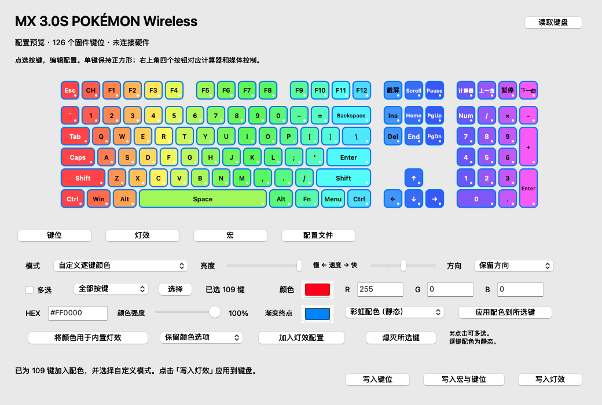

# CherryMac

在 Mac 上配置你的 **CHERRY MX 3.0S 宝可梦无线键盘**：点选键位，设置快捷键、灯光和宏，也可以让 F5 在浏览器中刷新页面。

> 当前为开发预览版，适合参与测试。部分键位与灯光已完成实物测试；计算器键的完整启动流程、宏的实体触发和断电后的配置保留仍待验证。

[下载 0.6.0 开发预览版](https://github.com/5hux1n/CherryMac/releases/tag/v0.6.0) · [详细使用说明](docs/使用说明.md) · [反馈问题](https://github.com/5hux1n/CherryMac/issues)


点选图上的按键即可编辑。普通单键保持正方形，右上角四个按钮分别为计算器、上一曲、播放／暂停和下一曲。

## 能做什么

| 你想做的事 | CherryMac 提供的功能 | 当前状态 |
| --- | --- | --- |
| 改一个按键的功能 | 设置快捷键组合、框选截图、刷新、媒体控制或禁用 | 已实测键位写入，部分预设仍待实体测试 |
| 调整键盘灯光 | 逐键 RGB、批量配色、渐变、单键熄灭，以及 12 种内置模式 | USB 参数与颜色读写已实测；动画外观、断电保留待验证 |
| 一键执行连续操作 | 编辑按下、松开和延迟步骤，将宏分配到按键 | 实验性；宏存储读写已实测，实体触发待验证 |
| 在 Mac 上使用 F5 刷新 | 在浏览器中把 F5 转换为 ⌘R | 可选 Mac 端适配；实体效果待验证 |
| 保存或迁移设置 | 自动备份，导入和导出 CherryMac 配置文件 | 已支持；导入后需手动写入 |

计算器键可设为调用 macOS 快捷操作来打开系统计算器。它不需要 CherryMac 监听按键，但需要先在应用中安装快捷操作；完整启动流程仍待复测。

## 下载与安装

- **系统：**macOS 13 或更新版本。
- **Mac：**下载包适用于 Apple Silicon（M1 及更新芯片）。Intel Mac 暂未验证。
- **键盘：**目前仅针对 CHERRY MX 3.0S Pokémon Wireless 开发，其他型号暂不支持。
- **连接：**写入键盘配置需要 USB 数据线，并切换到有线模式。只有充电功能的线不能使用。

1. 从[下载页面](https://github.com/5hux1n/CherryMac/releases/tag/v0.6.0)获取 ZIP，解压后将 `CherryMac.app` 放入“应用程序”文件夹。
2. 打开应用。在“系统设置 → 隐私与安全性 → 输入监控”中允许 CherryMac，退出并重新打开。
3. 用数据线连接键盘，切换到有线模式，然后点击“读取键盘”。

当前下载包未经过 Apple 公证。如果 macOS 阻止打开，请先确认下载来源，再参考 [Apple 关于打开 App 的说明](https://support.apple.com/zh-cn/102445)。

## 第一次设置

### 改键位

1. 点击“读取键盘”，应用会自动保存当前配置的备份。
2. 点选键盘图上的按键，在“键位”页选择功能。
3. 点击“加入待写入配置”，再点击“写入键位”。

**写入期间松开所有按键，不要使用键盘，等界面提示完成。** 编辑和导入只修改待写入配置，点击写入后才会改变键盘。

### 改灯光

**精细配色：**在“灯效”页点选按键，使用颜色面板、RGB 数值或 HEX 色号设置颜色，也能调整颜色强度。按住 ⌘ 点击或勾选“多选”，即可选择多个键；也可以选择全部按键、WASD、方向键或数字区。

选择自定义颜色、横向／纵向渐变、静态彩虹、皮卡丘或喷火龙配色，点击“应用配色到所选键”。“熄灭所选键”可关闭选中键的灯光。配色预览会显示在键盘图上，最后点击“写入灯效”。

**内置动画：**可选波纹、光谱、呼吸、霓虹、曲线、折返、放射、扩散、单点亮、常亮、闪电，以及自定义逐键颜色，共 12 种模式。调整亮度、速度和方向后，点击“加入灯效配置”，再点击“写入灯效”。支持单色的模式可以使用“将颜色用于内置灯效”，或选择彩虹颜色。

逐键颜色是静态配色，当前不能为每个键独立设置动画或速度。内置动画由键盘执行，在实体键盘上查看；不同模式可能忽略不适用的颜色、速度或方向设置。目前已验证参数写入与读回，动画外观仍需核对。



### 设置宏

在“宏”页添加按键和延迟，保存宏，再点选键盘按键，点击“分配到选中的键”。最后使用“写入宏与键位”一起写入。

宏目前只支持键盘按键和执行一次；每个按下都必须有对应的松开步骤。鼠标宏、循环和切换执行模式暂不支持。此功能仍在测试，尚未确认实体触发效果。

## 两种使用方式有什么区别

| 使用方式 | 适合做什么 | 连接与运行要求 |
| --- | --- | --- |
| 配置键盘 | 修改键位、灯光和键盘内的宏 | 通过 USB 写入；写入后由键盘直接输出设定的按键，断电与切换连接后的保留情况待验证 |
| Mac 端适配 | 例如只在浏览器里启用 F5 刷新 | 支持识别这款键盘的蓝牙与 USB 连接；需要 CherryMac 持续运行，实体效果待验证 |

Mac 端适配默认暂停。从菜单栏打开“Mac 端适配设置”并主动启用；除了输入监控，还需要辅助功能权限。

## 常见问题

**蓝牙或无线接收器可以写入配置吗？**

目前只支持 USB 写入，无线写入能力尚未确认。蓝牙可以用于 Mac 端按键适配。

**设置会永久保存在键盘里吗？**

还未完成断电测试，不能保证断电或切换到蓝牙后保留配置。写入成功和读回一致只能确认当时的设置。

**能导入 Windows 官方软件导出的配置吗？**

暂时不能。当前导入和导出使用 CherryMac 自己的 JSON 格式。

**备份在哪里？写入失败怎么办？**

在“配置文件”页点击“打开自动备份”。写入失败时，应用会尝试在全部按键松开后恢复原配置；如果恢复也失败，会显示备份路径，请重新读取键盘，确认实际配置。

**左键突然变成右键点击怎么办？**

可能是 Ctrl 等修饰键未释放。按下并松开 Ctrl、Alt、Win；仍异常时重新插拔键盘 USB。此前的实体测试出现过这类问题，现已加入松键检查，新流程仍待完整实体复测。

更多操作见[详细使用说明](docs/使用说明.md)。

## 参与测试

欢迎在 [Issues](https://github.com/5hux1n/CherryMac/issues) 中反馈问题，请附上 macOS 版本、键盘型号、连接方式、操作步骤和实际结果。

<details>
<summary>开发者：从源码构建与协议研究</summary>

安装 Xcode 命令行工具后，在仓库根目录运行：

```sh
bash Source/build.sh
```

脚本会运行离线自测，按本机架构生成 `CherryMac.app` 和 `CherryMac-0.6.0.zip`。自测不会改写键盘或安装系统快捷操作。

- [USB 实物验证与修饰键恢复](docs/USB硬件验证.md)
- [灯效功能与验证](docs/灯效功能与验证.md)
- [官方程序中的宏协议分析](docs/宏协议研究.md)
- [开源协议分析](docs/开源协议分析.md)
- [硬件配置研究](docs/硬件配置研究.md)
- [蓝牙接口实测](docs/蓝牙接口实测.md)

本仓库不包含 Windows 安装程序、官方图形资源或用户的导出配置。

</details>

本项目与 CHERRY 官方没有关联。
