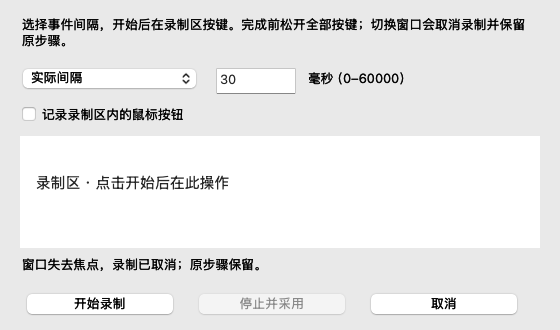

# 宏录制移植（源码进展）

客户端宏页提供独立录制窗口，网页宏页提供可展开的录制区；只采用当前录制区收到的键盘／鼠标按钮事件，不安装全局输入钩子，也不触发 HID 写入。系统或浏览器截获的快捷键、无法唯一识别的键位请手动添加。该增量尚未加入 Mac 0.11.0／Web 0.5.0 下载包。

## 时序与数据

纯状态机支持实际间隔、固定间隔及忽略间隔；时间由调用端的单调时钟提供。固定间隔作用于录制产生的每个事件，包括首事件；导入旧宏时保持各事件 Delay，不重新覆盖。实际间隔按官方录制路径限制为最多 60000 毫秒。完成后保存固定间隔录制选项，忽略间隔直接体现为事件零延迟。

依据官方 `0x449A70–0x449AB3` 的模式设置及 `0x45B40B–0x45B4AB` 的延迟生成分支：模式 2 使用固定值，模式 3 为零，模式 1 使用计时间隔并限制上限。现有本型号宏区组装继续使用每个事件的序列化字节。

开始录制前检查并要求松开修饰键。长按重复不新增步骤；开始前已按住的键，其孤立释放不录入。键盘和鼠标分别配对；未完全释放时停止会提示继续释放，不能采用不平衡步骤。取消、失焦、切换页面或容量错误丢弃本次录制，保留原编辑步骤；不合成释放、不静默补齐。上限仍为 256 事件与整个宏区容量校验。

原生 Control／Shift／Option／Command 左右侧状态使用 macOS SDK `IOKit/hidsystem/IOLLEvent.h` 的设备修饰键位掩码。无法从 AppKit 唯一判断的虚拟键编码拒绝录制，保留手工输入能力；不能据此声明原始 USB 事件完全捕获。

## 离线检查

原生 16 组自测通过，新增三种间隔的黄金事件序列、重复过滤、未释放停止拒绝、失焦取消及原生录制窗口普通键／Control 组合键适配检查。网页核心 29 项通过；Chrome 页面检查覆盖固定间隔录制、未松开停止后继续、保存与导出、切页取消、鼠标按钮录制与原步骤保留。浏览器自动化事件作为界面适配证据，不视为用户实体按键或宏固件执行证据。现有 15 组两端 Windows 混合宏转换一致性仍通过。

## 滚轮核对状态

公共动作表中的 Type 4／5 对应 X／Y 移动，控件为 `kb_mouse_x_left_edit` 等，不能套作滚轮。虽公共表包含消息 020A，已追踪的宏鼠标录制函数 `0x45BC40` 在 `0x45BF86` 只搜索六个基本按钮事件，另处理 020B／020C 的扩展按钮，其他消息在 `0x45C34E` 走清理返回。手工宏菜单也仅列五个鼠标按钮。这些证据尚不足以排除其他入口或型号分支支持滚轮，继续核对，不猜测滚轮方向与步数。

文本动作、本型号功能对照、录制完整性及写入／恢复产品流程继续推进；完成宏代码审查与离线校验后，再按用户顺序进行真机写入、执行和断电保留测试，然后推进灯效。

## 步骤排序（源码进展）

官方 MacroControl 资源包含 `macro_btn_uptop`、`macro_btn_up`、`macro_btn_down`、`macro_btn_downbottom`。两端现在提供置顶、上移、下移和置底：客户端选中文本中的一个步骤后使用下方按钮；网页在步骤行的“移动…”菜单选择位置。排序只修改编辑中的事件顺序，事件按键、状态、延迟不变；保存仍要求按下／松开配对，不自动补释放。

原生离线界面检查验证置底与置顶往返、选中步骤与顺序保持；17 组核心及 3 组研究检查通过。Chrome 实际表单检查把松开移到按下之前，确认保存拒绝，再恢复顺序并保存；同时覆盖来源字段保存、播放模式、109 个方形键位、窄屏和模拟普通键写入，页面无脚本错误。原生宏页已渲染并目视核对。未连接实体设备，发布包未更新。
