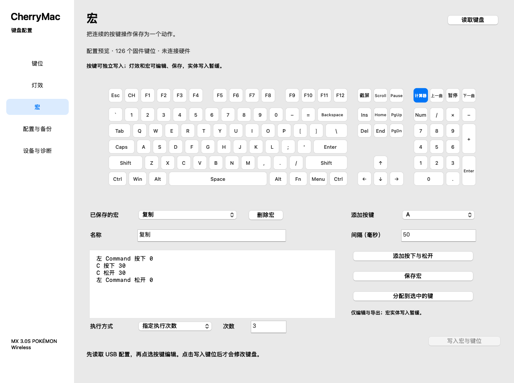

# 宏执行方式的两端移植

2026-10-03，基于用户提供的 CHERRY Utility 2.3.28.7 安装包中主程序静态分析。实现于 Mac 0.10.0 与 Web 0.4.0；宏执行方式仅完成离线实现与验证，宏写入仍按用户要求暂停。

## 官方分支与已确认格式

官方中文资源区分宏次数、按住持续、宏开关，提示分别为设置执行次数、松开停止、再次按键停止。键位序列化分支 `0x4FF225–0x4FF327` 读取 `ActionMacroType` 和 `ActionMacroLoopValue`：

| 官方类型 | 条件 | 键位三字节 | 编辑方式 |
| --- | --- | --- | --- |
| 0，次数 | 次数为 1 | `70 index 00` | 指定次数：1 |
| 0，次数 | 次数大于 1 | `71 index count` | 指定次数：2–255 |
| 1，持续 | 忽略循环次数字段 | `70 index 01` | 按住持续 |
| 2，开关 | 忽略循环次数字段 | `70 index 02` | 再次按键停止 |

该分支对 PID `C0CE` 有单次强制处理；目标 USB PID 为 `01CE`，不将其他型号的限制套用到本型号。表格说明软件编码，不证明固件实际执行或停止行为。

宏区事件格式未改变；执行方式位于每个物理键的绑定记录。同一宏可以有不同键位执行方式。保持停止机制未知时，不能放开持续／开关宏的实体写入，旧联合写入方法也继续拒绝此类不确定等待。

## 实现

配置新增可选 `macroModes`，按物理槽位保存 `{mode,count}`；mode 为 count、held 或 toggle。缺少该字段的旧 CherryMac 配置仍按执行一次处理。持续与开关模式的规范 count 为 1，官方 JSON 中无关的循环次数不会用于生成额外执行。

完整硬件配置读取可以识别上述绑定，并保持原键位模式；Windows 导入保存执行方式，编辑与导出在两端一致。指定次数范围为 1–255，未知模式、失效索引与无对应绑定的执行选项拒绝导入。正常改键或删除宏时会删除相关执行选项。

原生宏页面和网页宏页面均增加执行方式与次数选项；点击“分配到所选键”才保存该绑定方式。宏改变仍不能通过按键写入入口发送；未改动的既有宏绑定继续保留。

固定间隔录制界面、鼠标／滚动事件、文本动作和设备设置仍有移植缺项，不将这些模式扩展计作完整复刻完成。

## 验证

- 原生自测：五种规范记录、绑定读回与配置往返、旧配置兼容、未知模式和无效次数拒绝，界面次数与开关选择以及普通改键清理选项。
- 网页核心 26 项通过，新增模式往返、Windows 三类模式导入与基线不变检查；已有按键写入限制继续通过。
- `node Web/tests/native-profile-parity.mjs` 比较五种模式样例、两个共享宏绑定及修饰键事件，Swift 和网页的键位、事件、宏绑定、模式与其他完整配置区逐字节一致。脚本只调用文件转换 CLI。
- Chrome 模拟 WebHID 操作验证指定次数、持续与开关的可见选项、导出 JSON 的模式与实际绑定字节；随后仅模拟七包普通按键写入，灯效和宏区保持原值。

以上是静态协议、文件和模拟界面证据，不能证明实体重复次数、松开中止、开关中止或断电保留。宏实体测试解除暂停后，需要逐项验证结束与释放，再启用相应写入。



## 发布包 SHA-256

```text
7a23e9958072c67de48786cd8615d6f6de1de7be206c5d11309c84a08d64ddea  CherryMac-0.10.0.zip
f0cde751d53a3458f9d6138445ce78263a0524ba614cd76a06d789ae722e5677  CherryMac-Web-0.4.0.zip
```


## 固定间隔配置兼容（源码进展，尚未加入上述发布包）

官方 `ActionMacroFixTimeIsSelected` 与 `ActionMacroFixTimeValue` 属于宏编辑／录制选项。原生与网页现在导入并保存为可选 `recordingDelay:{fixed,milliseconds}`，范围为 0–60000 毫秒；旧配置没有此字段仍能读取。保存已有宏时保留选项。实际事件中的 `Delay` 保持原值，不根据该选项批量替换。

静态证据来自用户提供的 Windows Utility EXE：事件转换函数 `0x480B80–0x480CEE` 将事件的 Delay 编码为小端 16 位毫秒、Type／按下位及 Button；本型号宏区生成路径 `0x4FFF17–0x5000CF` 在 `0x500054` 调用它，并直接复制四字节事件。该路径不读取固定间隔字段。UI 在 `0x51043E` 和 `0x510467` 读入固定值与选择状态；`0x449A70–0x449AB3` 在模式 2 时调用固定值获取函数 `0x45DFC0`，录制／编辑分支 `0x45B40B–0x45B453` 根据模式选择固定值、零或计时间隔。字段不等同于固件全局延迟覆盖。

新增测试让固定值 777 与实际事件延迟 0／20／50 毫秒刻意不同，验证两个选择状态、配置往返、原生编辑保留、非法范围拒绝以及宏区不变。网页核心 27 项、原生 16 组自测通过；15 组两端转换对照覆盖五种执行配置与三种固定间隔字段组合。实体宏写入与执行仍未测试，录制功能与完整宏事件类型继续开发。

Chrome 页面测试另行覆盖导入 CherryMac 固定间隔配置、通过真实表单改名与保存、下载导出文件并比较事件与选项；仅模拟按键写入仍为七包 cmd09，宏和灯效无写入，页面无脚本错误。该测试未连接实体设备。
